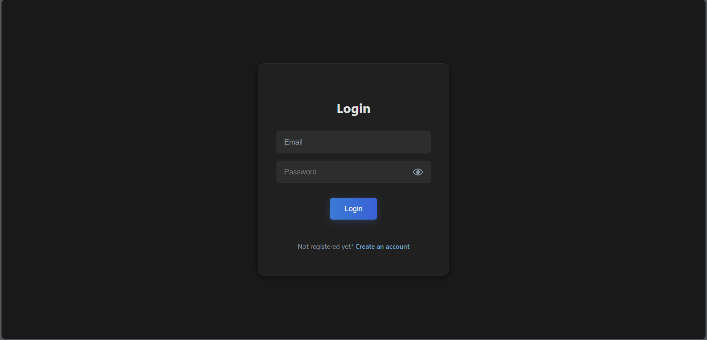
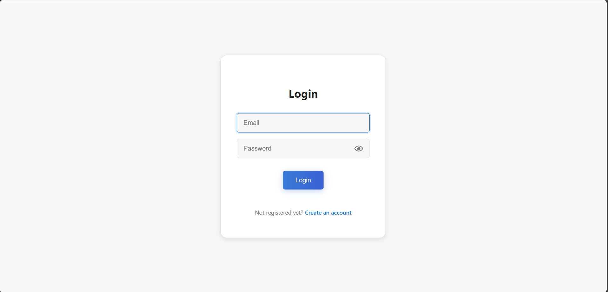
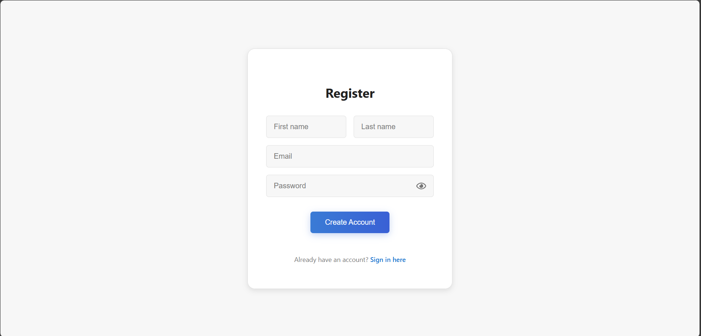

# 📝 Notes Hub - MERN Stack Application

**Notes Hub** is a full-featured note-taking web application built with the **MERN stack** (MongoDB, Express.js, React, Node.js). It supports authentication, tagging, search, pinning, reminders, label management, and note sharing.

## 🔗 Live Demo

- 🌐 **Frontend (User Interface)**: [https://notes-hub-mern.vercel.app](https://notes-hub-mern.vercel.app)
- 🛠️ **Backend API** (for API tools like Postman): [https://noteshub-mern.onrender.com](https://noteshub-mern.onrender.com)

> ⚠️ Note: The Render backend may take a few seconds to spin up if inactive.

---

## 📦 Features

- 🔐 **Authentication** (JWT-based with secure password hashing)
- 🗒️ **Add, edit, delete notes**
- 📌 **Pin, archive, mark complete**
- 🏷️ **Label/tag support**
- 📤 **Share notes via email**
- 🔎 **Search notes by keyword or tag**
- ⏰ **Reminder support**
- 🌗 **Dark/light mode toggle**
- 📱 **Responsive & mobile-friendly UI**
- 🧪 **Rate-limiting on login/signup to prevent abuse**

---

## 🛠️ Tech Stack

### Frontend
- React
- Vite
- React Router
- MUI (Material UI)
- Axios
- React Hook Form
- React Toastify

### Backend
- Node.js
- Express.js
- MongoDB with Mongoose
- JWT (authentication)
- Bcrypt (password hashing)
- Winston (logging)
- Express Validator
- Express Rate Limit
- Helmet, CORS, Cookie Parser

---

## 🚀 Getting Started

### 1. Clone the repository:
```bash
git clone https://github.com/DenislavaVM/NotesHub-MERN
cd NotesHub-MERN
```

### 2. Setup Backend

```bash
cd backend
npm install
```

#### Create a `.env` file in the `backend` directory with the following content:
```
PORT=3000
MONGO_URI=mongodb://localhost:27017/notes-app
ACCESS_TOKEN_SECRET=your-secret-key
```

Start backend:
```bash
npm start
```

### 3. Setup Frontend

```bash
cd ../frontend
npm install
npm run dev
```

Visit: `http://localhost:5173`

---

## 📸 Screenshots

| Dashboard (Dark) | Dashboard (Light) |
|------------------|-------------------|
|  |  |

| Add/Edit Note (Dark) | Add/Edit Note (Light) |
|----------------------|-----------------------|
|  |  |

| Login (Dark) | Login (Light) |
|--------------|---------------|
|  |  |

| Register (Dark) | Register (Light) |
|-----------------|------------------|
|  |  |

---

## ✅ Status

This project is **complete** and actively maintained. It's built to demonstrate:
- Frontend development (React, MUI)
- Backend API design (Express, MongoDB)
- Authentication
- Real-world CRUD + sharing features

## 📄 License

This project is licensed under the [MIT License](./LICENSE.txt).